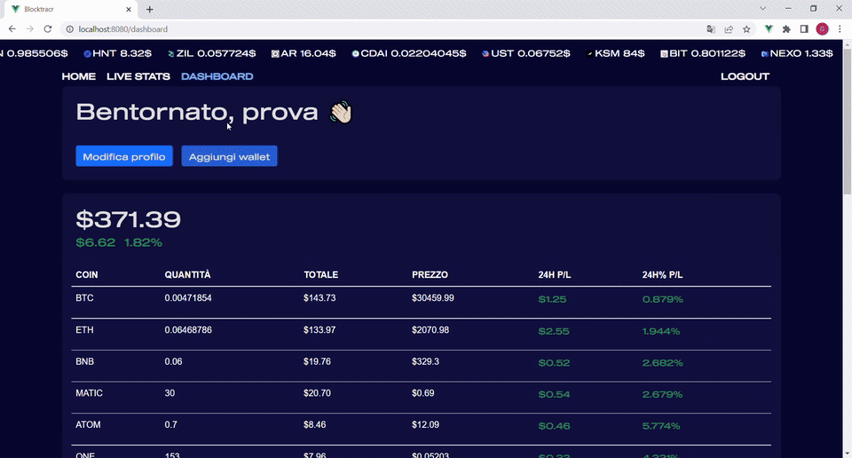
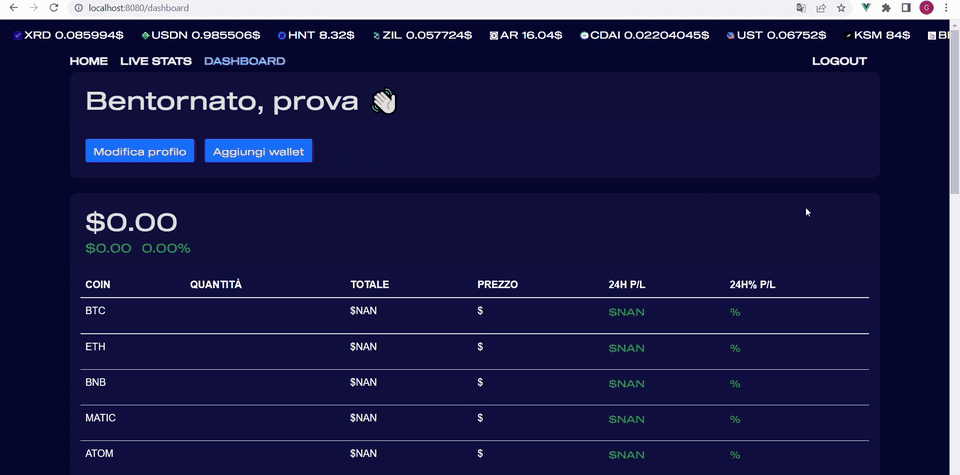

# Blocktracr

**Blocktracr** è una web application full-stack sviluppata come progetto universitario di gruppo presso la **Sapienza Università di Roma**.

L'applicazione permette di esplorare i dati del mercato delle criptovalute, analizzare le singole crypto attraverso statistiche e grafici storici e monitorare il proprio portafoglio tramite l'integrazione con gli exchange.

## Demo

### Analisi delle criptovalute



### Portfolio Dashboard



## Funzionalità

* **Analisi del mercato crypto** — visualizzazione di prezzi, capitalizzazione di mercato, volume degli scambi e variazioni nelle ultime 24 ore.
* **Dettaglio delle criptovalute** — informazioni dettagliate sulle singole crypto, inclusi prezzo, market cap, volume, supply e variazioni di prezzo.
* **Grafici interattivi** — visualizzazione dell'andamento storico dei prezzi su diversi intervalli temporali.
* **Monitoraggio del portafoglio** — visualizzazione degli asset, dei saldi, del valore corrente e del profit/loss nelle ultime 24 ore.
* **Visualizzazione del portafoglio** — grafici relativi alla composizione e alla performance del portafoglio.
* **Autenticazione degli utenti** — registrazione, login, hashing delle password e autenticazione tramite JWT.
* **Integrazione con gli exchange** — recupero dei dati del portafoglio attraverso gli exchange supportati da CCXT.
* **Sintesi tramite AI** — generazione di una versione sintetizzata delle descrizioni delle criptovalute tramite DeepAI.

## Tecnologie

### Frontend

* Vue.js 3
* Vue Router
* JavaScript
* Bootstrap
* Axios
* Chart.js
* Vue-Chartjs
* Mitt

### Backend

* Node.js
* Express
* Body-parser
* CORS

### Database

* MongoDB
* Mongoose

### Autenticazione

* JSON Web Tokens (JWT)
* bcrypt

### API e librerie esterne

* CoinGecko API
* CCXT
* DeepAI

## Architettura

Blocktracr è composto da una single-page application sviluppata con Vue.js, un backend Node.js/Express e un database MongoDB.

L'applicazione utilizza inoltre servizi esterni per ottenere dati sulle criptovalute, interagire con gli exchange e generare le sintesi tramite AI.

## Installazione

### Prerequisiti

* Node.js
* npm
* MongoDB

### Clonazione e installazione

```bash
git clone https://github.com/giorgiokr/Blocktracr-Progetto.git
cd Blocktracr-Progetto
npm install
```

### Variabili d'ambiente

Creare un file `.env` nella directory principale del progetto:

```env
MONGO_USER=
MONGO_PASSWORD=
MONGO_CLUSTER=
MONGO_DATABASE=
JWT_SECRET=
DEEPAI_API_KEY=
```
### Avvio

Avviare il frontend:

```bash
npm run serve
```

In un secondo terminale, avviare il backend:

```bash
npm run server
```

Frontend e backend vengono eseguiti come processi separati.

## Contesto del progetto

Blocktracr è stato sviluppato da **due studenti** durante l'anno accademico **2021/2022** per il corso di **Linguaggi e Tecnologie per il Web** della Sapienza Università di Roma.

La repository contiene la versione finale del progetto sviluppata per l'esame universitario.